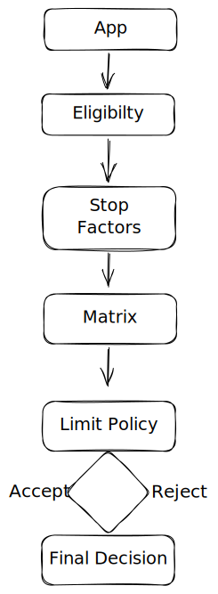

# API


**Good to know:** API is now in the production stage, and have only POST function.


## Get your API keys

HTTP - [http://127.0.0.1:8000/scoring](http://127.0.0.1:8000/scoring)

## Make your first request

To make your first request, send an authenticated request to the scoring endpoint. This will return a `scoring decision.`







String of MAX 7 characters



Integer of MAX 11 numbers 



String that is in brackets 

`{}`

and MAX 25 characters



```javascript
{
    "name"="Wilson",
    "owner": {
        "id": "sha7891bikojbkreuy",
        "name": "Samuel Passet",
    "species": "Dog",}
    "breed": "Golden Retriever",
}
```









Take a look at how you might call this method and what output to expect:



```javascript
[
  {
    "PIN_CODE": "qwertyu",
    "TX_FID": 12345678901,
    "APP_ID": "{q1w2e3r4t5y6u7i8o9p0asdfg}"
  }
]
```



```javascript
{
    "status": 200,
    "score": 42
}
```


